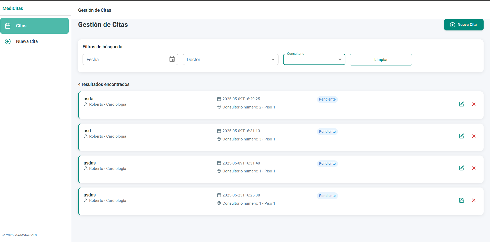
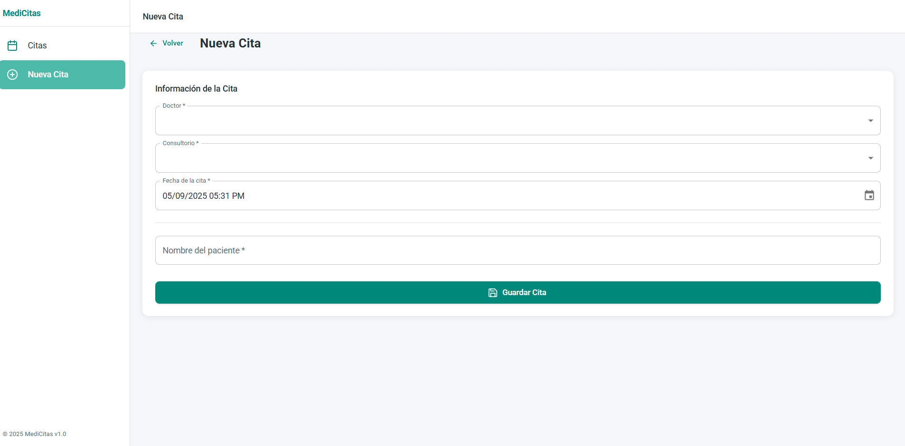

> ⚠️ **¡Importante!**
>
> Por favor, **lee este README completo antes de intentar desplegar o ejecutar el proyecto**.  
> Aquí encontrarás instrucciones esenciales para configurar correctamente el backend, el frontend y la base de datos.

---

# 🧩 Monorepo: Backend (Spring Boot) + Frontend (React)

Este proyecto es un monorepo que contiene tanto el backend como el frontend de una aplicación full-stack.  
Está diseñado para ser fácil de arrancar, modificar y desplegar. 🚀

---

## 📁 Estructura del proyecto

```
/backend   → API REST con Spring Boot (Java 21)
/frontend  → Aplicación web con React + Vite
```

---

## 🛠️ Requisitos previos

- [Java 21+](https://adoptium.net/)
- [Node.js 22+](https://nodejs.org/)
- [pnpm](https://pnpm.io/)
- [PostgreSQL](https://www.postgresql.org/) (puede ser local o en la nube)

---

## 🔙 Backend (Spring Boot + PostgreSQL)

### 📦 Tecnologías

- ✅ Java 21
- ✅ Spring Boot
- ✅ JPA / Hibernate
- ✅ PostgreSQL

### 🚀 Instrucciones para levantar el backend

1. **Ir a la carpeta** del backend:

    ```bash
    cd backend
    ```

2. **Configura la base de datos**

   Abre el archivo `src/main/resources/application.properties` y modifica estas variables:

   ```properties
   spring.datasource.url=jdbc:postgresql://TU_SERVIDOR:5432/TU_BASE_DE_DATOS
   spring.datasource.username=TU_USUARIO
   spring.datasource.password=TU_PASSWORD
   ```

   > ⚠️ **Importante:**
   > - Asegúrate de tener PostgreSQL corriendo.
   > - La ESTRUCTURA de la base de datos se creará automáticamente al iniciar la aplicación por primera vez, solamente debes haberla creado previamente.
   > - **Deberás insertar manualmente algunos datos iniciales** necesarios para el correcto funcionamiento del sistema:
   >
   > #### 🏥 Tabla `consultorio`
   > Campos:
   > - `id`
   > - `numero`
   > - `piso`
   >
   > #### 🩺 Tabla `doctor`
   > Campos:
   > - `id`
   > - `nombre`
   > - `apellido_paterno`
   > - `apellido_materno`
   > - `especialidad`
   >
   > Puedes usar sentencias `INSERT INTO` para poblar estas tablas con datos iniciales

3. **Levanta el servidor**

   Puedes usar Maven o tu IDE preferido:

   ```bash
   ./mvnw spring-boot:run
   ```

   > El backend correrá por defecto en: `http://localhost:8080`

---

## 🌐 Frontend (React + Vite)

### 📦 Tecnologías

- ✅ React
- ✅ Vite
- ✅ pnpm
- ✅ Node.js 22

### 🚀 Instrucciones para levantar el frontend

1. **Ir a la carpeta** del frontend:

    ```bash
    cd frontend
    ```

2. **Instalar dependencias**

    ```bash
    pnpm install
    ```

3. **Configura la variable de entorno**

    Crea un archivo `.env` y agrega lo siguiente:

    ```env
    VITE_API_URL=http://localhost:8080
    ```

    > Reemplaza `http://localhost:8080` por la URL donde tengas corriendo tu backend.

4. **Levanta el servidor de desarrollo**

    ```bash
    pnpm dev
    ```

   > La aplicación estará disponible en: `http://localhost:5173`

---

## ✅ Comprobación rápida

| Servicio  | URL                         |
|-----------|-----------------------------|
| Backend   | `http://localhost:8080`     |
| Frontend  | `http://localhost:5173`     |

---

## 📸 Capturas 

### 🏠 Lista de citas


### 📊 Formulario de creacion


---

## 🧠 Notas finales

- El monorepo está pensado para un flujo de trabajo claro entre frontend y backend.
- Asegúrate de tener configuradas las variables de entorno y los puertos correctamente.

---

## 🧑‍💻 Autor: **Obeth Morales**

> 💬 **Nota personal**
>
> ---
> ✨ Aunque me faltaron algunas funcionalidades en la UI, todos los métodos y la lógica están implementados en el backend, conforme a lo solicitado en las instrucciones.
>
> ❗ Solo no me dio tiempo para terminar la parte visual 😢.
> ---
